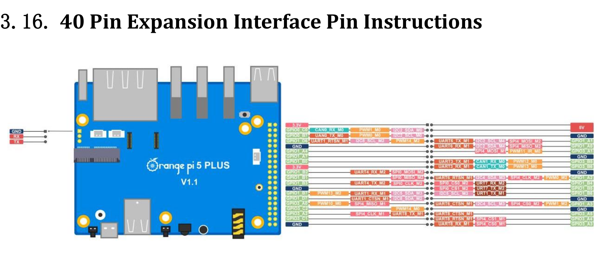
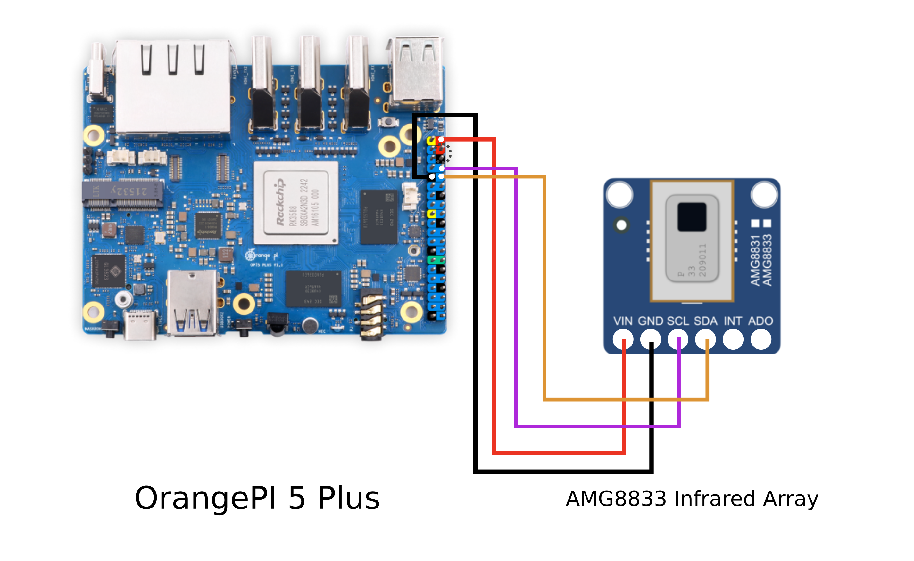

# Python Thermal Camera with Orange PI (AMG8833)

This is a documentation of using AMG8833 infrared array on Orange PI 5 (Plus model) inspired and full-based on the original documentation and code of using it on Raspberry Pi 4 ([see repository here](https://github.com/makerportal/AMG8833_IR_cam)).

## Hardware Configuration

### Wiring Diagram

#### i2c

Using the `40 Pin Expansion Interface Pin Instructions`, we have multiple i2c **SCL/SDA** pin's. We decided to use `I2C2_SCL_M4` and `I2C2_SDA_M4` (`GPIO1_A1` and `GPIO1_A0`) pins on the **Orange PI 5** board pins. See the pinout bellow:

    
OrangePI 5 Plus Pinout

    ### Heading
    

#### Power Supply

The AMG8833 is powered by 5V pin on the OrangePI 5 board and we decided to use GND pin on the side of the `I2C2_SDA_M4` because the pins on the circled by dot line on the image on the section bellow is used by calor fan.

#### Diagram

The bellow image contains the connections of the OrangePI 5 Plus and AMG8833 used by the project:

### - Real-Time Interpolated IR Camera - 

The following plot is outputted by the example script:
 - /examples/IR_cam_interp.py

### - Wiring Diagram - 

The AMG8833 is powered by the 5V pin on the Raspberry Pi, and wired to the SDA/SCL pins on GPIO 2 and GPIO 3, respectively. 

### - Example Output - 

The following plot is outputted by the example script:
 - /examples/IR_cam_test.py

